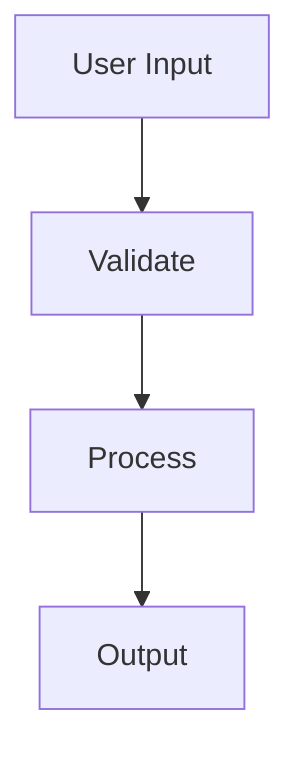

## installation

`spacecake` is currently available for macOS. Download the latest release from the [homepage](/) or [GitHub](https://github.com/spacecake-labs/spacecake/releases).

### step 1: download

Choose either the `.dmg` (disk image) or `.zip` file and download it.

### step 2: install

**for DMG:**

1. open the downloaded `.dmg` file
2. drag the `spacecake` app into your Applications folder
3. launch `spacecake` from Applications or Spotlight (cmd+Space)

**for ZIP:**

1. extract the `.zip` file
2. move the extracted `spacecake.app` to your Applications folder
3. launch `spacecake` from Applications or Spotlight (cmd+Space)

### step 3: open your first project

when `spacecake` launches, you'll be prompted to select a folder. choose the root directory of any existing codebase (or create a new folder if you're starting fresh).

`spacecake` will analyze your project and display its structure in the file tree on the left.

## your first spec

### create a new document

1. in the file tree, click the three dots (`•••`) next to the folder where you want to create the document
2. select "new file" and name it something like `spec.md`
3. the file opens in the editor—you're ready to write!

### writing your spec

`spacecake` supports full markdown with some powerful additions:

**code blocks**
write code blocks with syntax highlighting and full editor features:

````markdown
```python
def hello_world():
    print("hello from spacecake!")
```
````

**checklists**
create execution plans with checklists:

```markdown
- [ ] set up database migrations
- [ ] implement user authentication
- [ ] write integration tests
```

**diagrams**
embed [Mermaid](https://mermaid.js.org/) diagrams for system architecture:

````markdown

````

**rich mode (WYSIWYG) or source mode (live preview)**
toggle between rich mode (see formatted text as you type) and source view (live preview) using the view toggle button in the toolbar.

## working with code

one of `spacecake`'s superpowers is editing code directly in your specs.

### code blocks with full editor features

double-click or click into any code block to activate the editor. you get:

- **syntax highlighting** for Python, TypeScript, and more
- **autocompletion** with intelligent suggestions
- **bracket closing** and auto-indentation
- **code folding** for large blocks
- **linting** to catch errors early
- **standard keyboard shortcuts** (Ctrl+D to duplicate, etc.)

### keyboard shortcuts

- **cmd+/** - toggle comment
- **cmd+D** - select next match (multi-select)
- **cmd+shift+K** - delete line
- **tab/shift+tab** - indent/outdent
- **cmd+F** - find in current block

## troubleshooting

**"permission denied" on macOS?**
if you see a security warning, go to System Settings → Privacy & Security and allow `spacecake` to run.

**something looks wrong?**
try pressing **cmd+R** to refresh the app. if the issue persists in rich mode, switch to source mode to see the underlying code and diagnose the problem.

**debugging issues:**
you can open Chrome DevTools from within `spacecake` to view console logs and debug any issues you encounter.

**need help?**
found a bug or have a question? open an issue on [GitHub](https://github.com/spacecake-labs/spacecake/issues).
