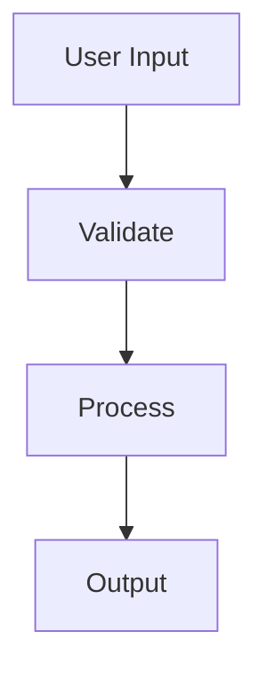

## installation

`spacecake` is available for macOS and Linux (Debian). download the latest release from the [homepage](/) or [GitHub](https://github.com/spacecake-labs/spacecake/releases).

you can also build from source by following the steps in the [release pipeline](https://github.com/spacecake-labs/spacecake/blob/main/.github/workflows/release.yml).

### step 1: download

- **macOS**: download the `.dmg` file (arm64 for Apple Silicon, x64 for Intel) or `.zip` for manual installation
- **Linux**: download the `.deb` file (for Debian-based distributions like Ubuntu)

### step 2: install

**for DMG (macOS):**

1. open the downloaded `.dmg` file
2. drag the `spacecake` app into your Applications folder
3. launch `spacecake` from Applications or Spotlight (cmd+Space)

**for ZIP (macOS):**

1. extract the `.zip` file
2. move the extracted `spacecake.app` to your Applications folder
3. launch `spacecake` from Applications or Spotlight (cmd+Space)

**for DEB (Linux):**

1. install the package: `sudo dpkg -i spacecake_*.deb`
2. launch `spacecake` from your application menu or run `spacecake` in your terminal

### step 3: open your first project

when `spacecake` launches, you'll start in your home folder (`~/.spacecake`). press `⌘O` to open your project's root directory.

you can create notes and folders in your home folder, or open any project folder as a workspace anytime.

## 🖥️ terminal

the integrated terminal is at the bottom of the screen. click it or drag to resize.

- powered by [Ghostty](https://ghostty.org/)
- run any CLI tool, including Claude Code

## 🦀 claude code integration

run `claude` from the integrated terminal - it should automatically connect to spacecake, giving Claude context about your open files.

if Claude shows "IDE disconnected", run `/ide` to check the connection status. you should see spacecake listed and can select it to reconnect.

a green **Claude Code** badge in the status bar indicates an active Claude session is connected.

## 📝 writing markdown

`spacecake` supports GitHub-flavoured markdown.

write code blocks with syntax highlighting:

```python
def hello_world():
    print("hello from spacecake!")
```

create execution plans with checklists:

```markdown
- [ ] set up database migrations
- [ ] implement user authentication
- [ ] write integration tests
```

embed [Mermaid](https://mermaid.js.org/) diagrams for system architecture:



toggle between rich mode (WYSIWYG) and source mode (live preview) using the view toggle button in the toolbar.

## ⚙️ troubleshooting

**"permission denied" on macOS?**
go to System Settings → Privacy & Security and allow `spacecake` to run.

**something looks wrong?**
press `⌘R` to refresh the app. if the issue persists in rich mode, switch to source mode to see the underlying markdown.

**debugging issues:**
open Chrome DevTools from within `spacecake` to view console logs.

## 💬 feedback & issues

have feedback, found a bug, or want to request a feature?

- click the **chat icon** in the bottom left corner of the app to share your thoughts directly
- open an issue on [GitHub](https://github.com/spacecake-labs/spacecake/issues)
