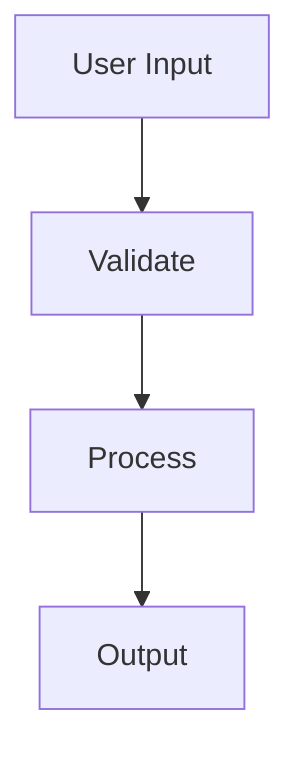

## installation

`spacecake` is available for macOS, Windows, and Linux. download the latest release from the [homepage](/) or [GitHub](https://github.com/spacecake-labs/spacecake/releases).

you can also build from source by following the steps in the [release pipeline](https://github.com/spacecake-labs/spacecake/blob/main/.github/workflows/release.yml).

### step 1: download

- **macOS**: download the `.dmg` file (arm64 for Apple Silicon, x64 for Intel) or `.zip` for manual installation
- **Windows**: download the `.exe` installer
- **Linux**: download the `.deb` file (for Debian-based distributions like Ubuntu) or `.AppImage` for other distros

### step 2: install

**for DMG (macOS):**

1. open the downloaded `.dmg` file
2. drag the `spacecake` app into your Applications folder
3. launch `spacecake` from Applications or Spotlight (cmd+Space)

**for ZIP (macOS):**

1. extract the `.zip` file
2. move the extracted `spacecake.app` to your Applications folder
3. launch `spacecake` from Applications or Spotlight (cmd+Space)

**for EXE (Windows):**

1. run the downloaded `.exe` installer
2. follow the installation prompts (you may see a Windows SmartScreen warning since the installer isn't code-signed yet - click "More info" then "Run anyway" to proceed)
3. launch `spacecake` from the Start menu or desktop shortcut

**for DEB (Linux):**

1. install the package: `sudo dpkg -i spacecake_*.deb`
2. launch `spacecake` from your application menu or run `spacecake` in your terminal

### step 3: open your first project

when `spacecake` launches, you'll start in your home folder (`~/.spacecake`). press `⌘O` (or `ctrl+o` on Windows/Linux) to open your project's root directory.

you can create notes and folders in your home folder, or open any project folder as a workspace anytime.

## editor basics

### workspaces

a workspace is a folder you're working in. switch workspaces with `⌘O` / `ctrl+o` or the folder icon in the toolbar.

your home folder (`~/.spacecake`) is always available for notes that aren't tied to a specific project.

### files and tabs

- **quick open**: press `⌘P` / `ctrl+p` to search and open files by name
- **new file**: press `⌘N` / `ctrl+n` to create a new file
- **close tab**: press `⌘W` / `ctrl+w` or click the × on the tab
- **save**: press `⌘S` / `ctrl+s` to save the current file

tabs show open files at the top of the editor. scroll horizontally if you have many tabs open.

### autosave

spacecake can automatically save files as you edit. enable autosave in workspace settings:

1. click the gear icon in the sidebar (or navigate to Settings)
2. toggle **enable autosave** on

when enabled, changes are saved to disk automatically - no need to press `⌘S` / `ctrl+s`.

### keyboard shortcuts

| action                | macos        | windows/linux |
| --------------------- | ------------ | ------------- |
| open/switch workspace | `⌘O`         | `ctrl+o`      |
| quick open file       | `⌘P`         | `ctrl+p`      |
| new file              | `⌘N`         | `ctrl+n`      |
| save file             | `⌘S`         | `ctrl+s`      |
| close tab             | `⌘W`         | `ctrl+w`      |
| toggle terminal       | `` ctrl+` `` | `` ctrl+` ``  |
| focus editor          | `⌘1`         | `ctrl+1`      |
| refresh app           | `⌘R`         | `ctrl+r`      |

## 🖥️ terminal

the integrated terminal is at the bottom of the screen. click it or drag to resize.

- powered by [Ghostty](https://ghostty.org/)
- run any CLI tool, including Claude Code

## 🦀 claude code integration

`spacecake` integrates with [Claude Code](https://docs.anthropic.com/en/docs/claude-code) to give Claude context about your open files and display live session metrics.

run `claude` from the integrated terminal - it automatically connects to spacecake and defaults to plan mode. when Claude creates a plan, press `ctrl+g` to open it directly in spacecake for editing.

see the [claude code integration](/claude-code-integration) guide for more details.

## 📝 writing markdown

`spacecake` supports GitHub-flavoured markdown.

write code blocks with syntax highlighting:

```python
def hello_world():
    print("hello from spacecake!")
```

create execution plans with checklists:

```markdown
- [ ] set up database migrations
- [ ] implement user authentication
- [ ] write integration tests
```

embed [Mermaid](https://mermaid.js.org/) diagrams for system architecture:



toggle between rich mode (WYSIWYG) and source mode (live preview) using the view toggle button in the toolbar.

## ⚙️ troubleshooting

**"permission denied" on macOS?**
go to System Settings → Privacy & Security and allow `spacecake` to run.

**something looks wrong?**
press `⌘R` to refresh the app. if the issue persists in rich mode, switch to source mode to see the underlying markdown.

**debugging issues:**
open Chrome DevTools from within `spacecake` to view console logs.

**slow file watching on linux or windows?**
spacecake uses @parcel/watcher for detecting file changes. on linux and windows, installing [watchman](https://facebook.github.io/watchman/) significantly improves file watching performance and reliability for large projects. spacecake will show a tip in the status bar recommending this. see the [watchman installation guide](https://facebook.github.io/watchman/docs/install) for setup instructions.

## 💬 feedback & issues

have feedback, found a bug, or want to request a feature?

- click the **chat icon** in the bottom left corner of the app to share your thoughts directly
- open an issue on [GitHub](https://github.com/spacecake-labs/spacecake/issues)
