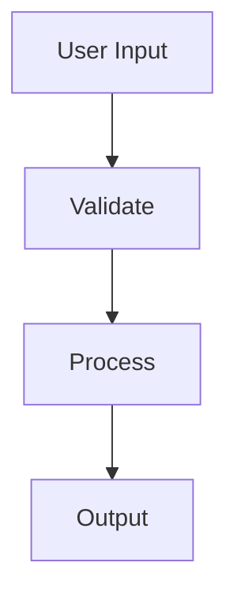

`spacecake` supports GitHub-flavoured markdown with a visual editor that renders content as you type.

## code blocks

write code blocks with syntax highlighting:

```python
def hello_world():
    print("hello from spacecake!")
```

## checklists

create execution plans with checklists:

```markdown
- [ ] set up database migrations
- [ ] implement user authentication
- [ ] write integration tests
```

## mermaid diagrams

embed [Mermaid](https://mermaid.js.org/) diagrams for system architecture:



## rich mode vs source mode

toggle between rich mode (WYSIWYG) and source mode using the view toggle button in the toolbar.

- **rich mode**: renders markdown visually as you type — headings, code blocks, diagrams, and checklists are all interactive
- **source mode**: shows the raw markdown with a live preview, useful for precise editing or debugging formatting issues
