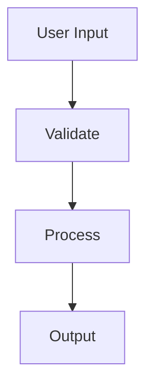

`spacecake` supports GitHub-flavoured markdown with a visual editor that renders content as you type.

## slash commands

type `/` anywhere in the editor to open the command menu. start typing to filter:

| command        | shortcut | description                |
| -------------- | -------- | -------------------------- |
| `/code`        |          | insert a code block        |
| `/frontmatter` |          | insert YAML frontmatter    |
| `/text`        |          | convert block to paragraph |
| `/heading 1`   | `#`      | insert an h1 heading       |
| `/heading 2`   | `##`     | insert an h2 heading       |
| `/heading 3`   | `###`    | insert an h3 heading       |

press `Esc` to dismiss the menu.

## code blocks

write code blocks with syntax highlighting:

```python
def hello_world():
    print("hello from spacecake!")
```

the language is auto-detected from the file type, or you can select it manually from the language picker in the code block header.

## checklists

create execution plans with checklists:

```markdown
- [ ] set up database migrations
- [ ] implement user authentication
- [ ] write integration tests
```

## mermaid diagrams

embed [Mermaid](https://mermaid.js.org/) diagrams for system architecture:


```mermaid
graph TD
    A[User Input] --> B[Validate]
    B --> C[Process]
    C --> D[Output]
```

## frontmatter

insert a YAML frontmatter block at the top of your document with the `/frontmatter` slash command. frontmatter has two view modes:

- **table mode** — displays key-value pairs in a two-column table for quick scanning
- **code mode** — full YAML editing with syntax highlighting and line numbers

click the toggle button in the frontmatter header to switch between modes. if the frontmatter already exists, the slash command scrolls to it instead of creating a duplicate.

## images

markdown images render inline in rich mode. click an image to select it, then drag any of the resize handles to change its dimensions.

images support alt text, captions, and custom width/height attributes.

## rich mode vs source mode

toggle between rich mode (WYSIWYG) and source mode using the view toggle button in the toolbar.

- **rich mode**: renders markdown visually as you type — headings, code blocks, diagrams, and checklists are all interactive
- **source mode**: shows the raw markdown with a live preview, useful for precise editing or debugging formatting issues

## README rendering

README files (`README.md`) use GitHub-style line break handling. single newlines within a paragraph are visually collapsed — consecutive lines flow together as one paragraph, matching how GitHub renders them. double newlines still create paragraph breaks as usual.

this means what you see in spacecake matches what collaborators see on GitHub, without altering the underlying file.
